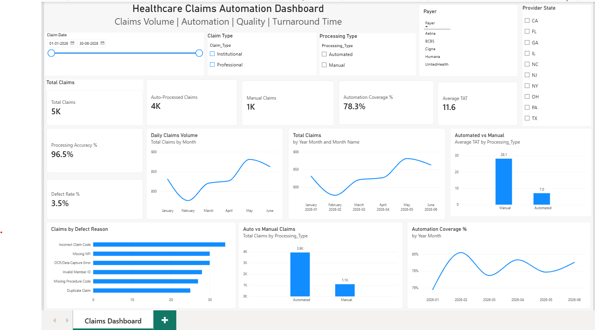

# Healthcare Claims Automation Dashboard

## Project Overview

Interactive Power BI dashboard designed to monitor
healthcare claims processing performance.

## Business Objectives

- Monitor claims volume
- Measure automation coverage
- Track processing accuracy
- Identify defects
- Monitor turnaround time

## Key KPIs

- Total Claims
- Automated Claims
- Manual Claims
- Automation Coverage
- Processing Accuracy
- Defect Rate
- Average TAT

## Power BI Skills Demonstrated

- Power Query
- Data Cleaning
- Data Modeling
- Star Schema
- DAX
- KPI Development
- Interactive Slicers
- Drill-through
- Tooltips
- Bookmarks
- Dashboard Design

## Dataset

Synthetic healthcare claims dataset created
for educational and portfolio purposes.

## Dashboard
The dashboard provides an interactive view of healthcare claims
processing performance, including claims volume, automation coverage,
processing accuracy, defect rate, and turnaround time.

